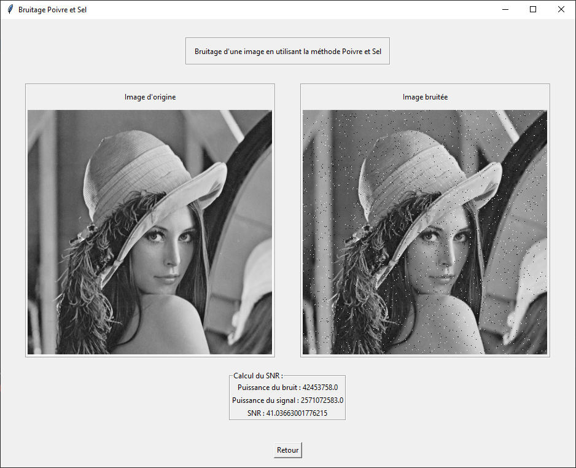

# Manipulation d'images
Projet de fin de semestre 3 du DUT Informatique.  
Création d'un programme en Python permettant de bruiter et filtrer une image avec calcul du SNR.

## Fonctionnalités
**Sélection des images**  
Le programme Python vous propose de sélectionné l'image que vous souhaitez bruiter ou filtrer.  

**Valeur du bruit**  
Il est aussi possible de sélectionner la valeur du bruit appliqué aux images.  

**Calcul du SNR**  
Le programme se charge de calculer le SNR, c'est à dire la différence de qualité entre l'image bruité et l'image filtré.

## Algorithmes
### Bruitage
**Bruitage Poivre et Sel**  
Ce type de bruitage se charge d'ajouter aléatoirement des pixels noirs et blancs sur l'ensemble de l'image.  

**Bruitage additif**  
Ce type de bruitage se charge de générer un bruit.  
La valeur de ce bruit est ensuite additionné sur la valeur des pixels de l'image.  

**Bruitage multiplicatif**  
Ce type de bruitage se charge, lui aussi, de générer un bruit.  
La valeur de ce bruit est ensuite multiplié sur la valeur des pixels de l'image.  

### Filtrage
**Filtrage Médian**  
Ce type de filtrage se charge de faire une moyenne des pixels avoisinant le pixel sélectionné afin de lui attribuer une nouvelle valeur.  
Ce filtrage est particulièrement efficace sur le bruitage poivre et sel.  

**Filtrage par convulsion**  
Ce type de filtrage à un fonctionnement similaire au filtrage médian.  
Cependant, la zone sélectionné pour réaliser la moyenne des valeurs des pixels inclus aussi le pixel sélectionné.  
Ce filtrage est particulièrement efficace sur le bruitage additif.  

**Filtrage de Kuwahara**  
Ce type de filtrage se charge de prendre 4 zones autour du pixel sélectionné.  
Ensuite, l'algorithme calcule la variance et sélectionne la valeur moyenne d'une des zones ayant la plus faible variance avant de l'insérer dans le pixel sélectionné.
Ce filtrage est particulièrement efficace et adapté pour le bruitage additif et multiplicatif.
