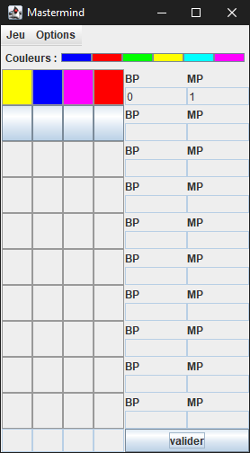

# Mastermind
Projet du semestre 4 du DUT Informatique.  
Création d'une application Java avec interface graphique reprenant les règles du jeu du Mastermind.  

## Fichiers
* [Modèle](https://github.com/dut-informatique/mastermind/blob/main/ModeleMastermind.java)
* [Vue](https://github.com/dut-informatique/mastermind/blob/main/VueMastermind.java)
* [Fenêtre](https://github.com/dut-informatique/mastermind/blob/main/FenetreMastermind.java)
* [Contrôleur](https://github.com/dut-informatique/mastermind/blob/main/ControleurMastermind.java)
* [Application](https://github.com/dut-informatique/mastermind/blob/main/Application.java)
