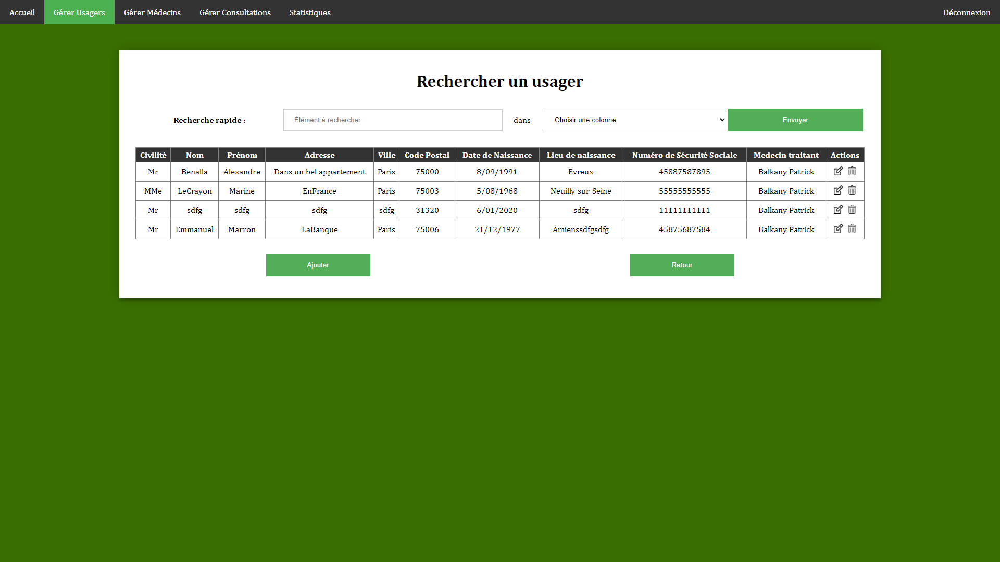

# Cabinet médical
Projet de fin de semestre 3 du DUT Informatique.  
Création d'un site web permettant la consultation, l'enregistrement, la modification et la suppression de données.  

## Sommaire
* [Fonctionnalités](https://github.com/dut-informatique/cabinet-medical#fonctionnalités)
* [Technologies utilisées](https://github.com/dut-informatique/cabinet-medical#technologies-utilisées)

## Fonctionnalités
**Compte utilisateur**  
Le site dispose d'un système de compte utilisateur permettant de limiter l'accès aux fonctionnalités du site.  

**Gestion des patients**  
Le site dispose d'un espace dédié pour gérer les patients du cabinet.  
Il est alors possible d'ajouter des patients, d'en modifier ou d'en supprimer.  
Chaque patient est identifiable avec un nom, prénom, date de naissance, adresse et médecin référent.  
Un tableau composé de tous les patients est aussi disponible pour une édition rapide.  

**Gestion des médecins**  
Le site dispose d'un espace dédié pour gérer les médecins du cabinet.  
Il est alors possible, comme pour les patients, d'ajouter des médecins, d'en modifier ou d'en supprimer.  
Un tableau composé de tous les médecins est aussi disponible pour une édition rapide.  

**Gestion des rendez-vous**  
Le site dispose également d'un espace dédié à la gestion des rendez-vous entre patients et médecins.  
Il est alors possible de créer de nouveaux rendez-vous, de les modifier ou d'en supprimer.  
Un tableau composé de tous les rendez-vous est, la encore, disponible pour une édition rapide.  

**Statistiques**  
Une page dédiée concernant différentes statistiques établie à partir des données du cabinet est aussi accessible.  

## Technologies utilisées
* HTML 5
* CSS 3
* PHP
* SQL
