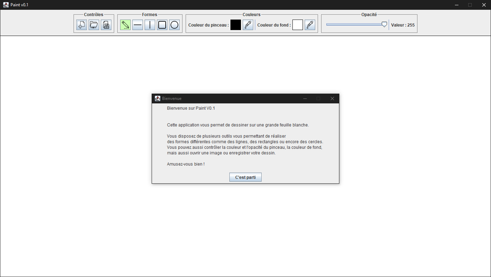

# Messagerie instantanée
Projet de fin de semestre 4 du DUT Informatique.  
Création d'une messagerie instantanée permettant l'envoie de messages depuis plusieurs utilisateurs.

## Sommaire
* [Fonctionnalités](https://github.com/dut-informatique/messagerie-instantanee#fonctionnalités)
* [Technologies utilisées](https://github.com/dut-informatique/messagerie-instantanee#technologies-utilisées)

## Fonctionnalités
**Nom d'utilisateur**  
Pour utiliser la messagerie, l'utilisateur doit entrer un nom dans la zone dédiée en haut de la messagerie.  
Sans cela, il ne pourra pas envoyer de messages.  

**Messages**  
La zone présente au centre permet d'afficher les messages en directe.  
Chaque message est identifiable avec le nom de l'expéditeur et la date à laquelle le message à été publié.  
Elle s'actualise automatiquement à chaque nouveau message reçu.  

**Zone de texte**  
En bas de la messagerie se trouve la zone de texte et le bouton d'envoie permettant d'envoyer un message.  
Les messages peuvent aussi être envoyé directement avec la touche "ENTRER".  

## Technologies utilisées
* HTML 5
* CSS 3
* PHP
* JavaScript
