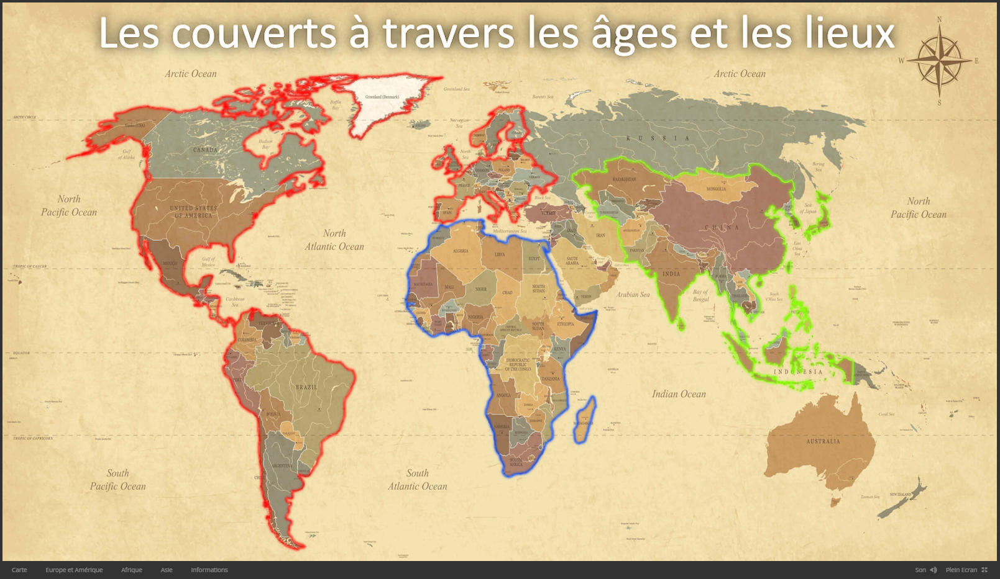

# Web-Documentaire
Projet de fin de semestre 2 du DUT Informatique.  
Création d'un Web-Documentaire sur le thème des couverts.

[Lien du WebDoc](https://dut.minarox.fr/webdoc)

## Sommaire
* [Fonctionnalités](https://github.com/dut-informatique/webdocumentaire#fonctionnalités)
* [Technologies utilisées](https://github.com/dut-informatique/webdocumentaire#technologies-utilisées)

## Fonctionnalités
**Chapitres**  
Le Web-Documentaire est composé de plusieurs chapitres.  
Chacun d'entres eux parle d'une région en particulier avec ses caractéristiques.  

**Interactif**  
Le Web-Documentaire est composé d'images, de vidéos, de sons et de textes.  
L'utilisateur peut alors intéragir avec chacun des éléments pendant son visionnage.  
Il est aussi possible de naviger librement entre les pages et de changer de chapitre à n'importe quel moment.  

**Plein écran**  
Le lecteur vidéo du Web-Documentaire dispose d'un mode plein écran qui s'adaptera automatiquement à votre écran.  

## Technologies utilisées
* [Klynt](https://www.klynt.net/)
* JavaScript
